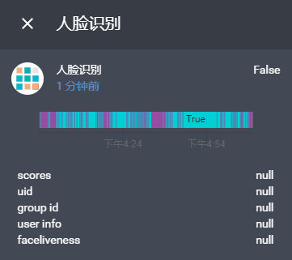

# face identity for [Home Assistant](https://home-assistant.io)  
    


## 插件说明
利用百度人脸识别API，将已接 HomeAssistant 的摄像头中的图像进行 M:N 人脸查找，若摄像头中存在人脸，且该人脸与要查找的人脸库中人脸相匹配，则返回相关信息。查找成功后，若图像中存在多张人脸，则主要返回得分最高者信息以及其他人脸的 user_id。在配置文件夹下的 www/baidu_face/ 文件夹下，若存在以 user_id 为前缀的照片，用相关照片替换该同名文件，识别成功时显示的头像照片会为替换内容。

## 版本更新提示
---
> **2020-04-28**<br />
> 增加人脸数统计， M:N 人脸对比
> 改用百度 python SDK
> 配置文件变动，请注意修改

---
> **2020-04-06**<br />
> 修改语法错误

---
> **2020-04-04**<br />
> 取消 tmp 文件，减少磁盘读写
---
> **2019-05-25**<br />
> 现已适配 0.92.0 之后版本请注意使用最新代码

## 使用
下载插件, 并将 baidu_face 放置于 custom_components 文件夹下

## 配置示例 :
```YAML
sensor:
  - platform : baidu_face
    app_id: "*****************" 
    api_key: "****************" 
    secret_key: "*************" 
    group_list: "group_id1,group_id2" # 格式例子,中间不能含有空格
    entity_id: "**************"    
    access_token: "***********"
    # liveness: "NORMAL"
    # name: "face indentity"
    # port: 8123
    # score: 80
```

| 参数 | 必选 | 类型 | 说明 |
|---|---|---|---|
| app_id | 是 | string | 百度人脸识别应用 **AppID** |
| api_key | 是 | string | 百度人脸识别应用 **API Key** |
| secret_key | 是 | string | 百度人脸识别应用 **Secret Key** |
| group_list | 是 | string | 人脸库用户组 **组名** (1~10) 个之内|
| entity_id | 是 | string | homeassistant 中摄像头实体名 |
| access_token | 是 | string | homeassistant 中永久令牌 |
| liveness | 否 | string | 活体检测控制 <br> **NONE**: 不进行控制 <br> **LOW**:较低的活体要求(高通过率 低攻击拒绝率) <br> **NORMAL**: 一般的活体要求(平衡的攻击拒绝率, 通过率) <br> **HIGH**: 较高的活体要求(高攻击拒绝率 低通过率) <br> 默认: **NORMAL** <br> 若活体检测结果不满足要求，则返回结果中会提示活体检测失败 |
| name | 否 | string | 该实体名 <br> # 默认: **"face indentity"**|
| port | 否 | int | homeassistant 设定的端口号 <br> # 默认: **8123**|
| score | 否 | int | 百度人脸识别阈值 # 默认: **80**|

## 返回信息说明
| 名称 | 含义 |
|---|---|
| group id  | 人脸搜索得分最高者的 group_id  |
| user id   | 人脸搜索得分最高者的 user_id   |
| user info | 人脸搜索得分最高者的 user info |
| score     | 人脸搜索得分最高者的 score     |
| face num  | 图像中包含的人脸数             |
| match_num | 图像中搜索通过的人脸数         |
| user list | 图像中搜索通过的人的 user_id   |
